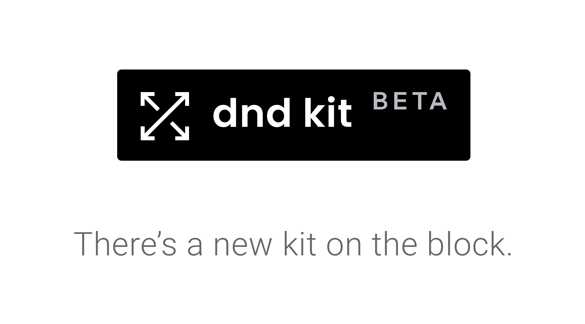
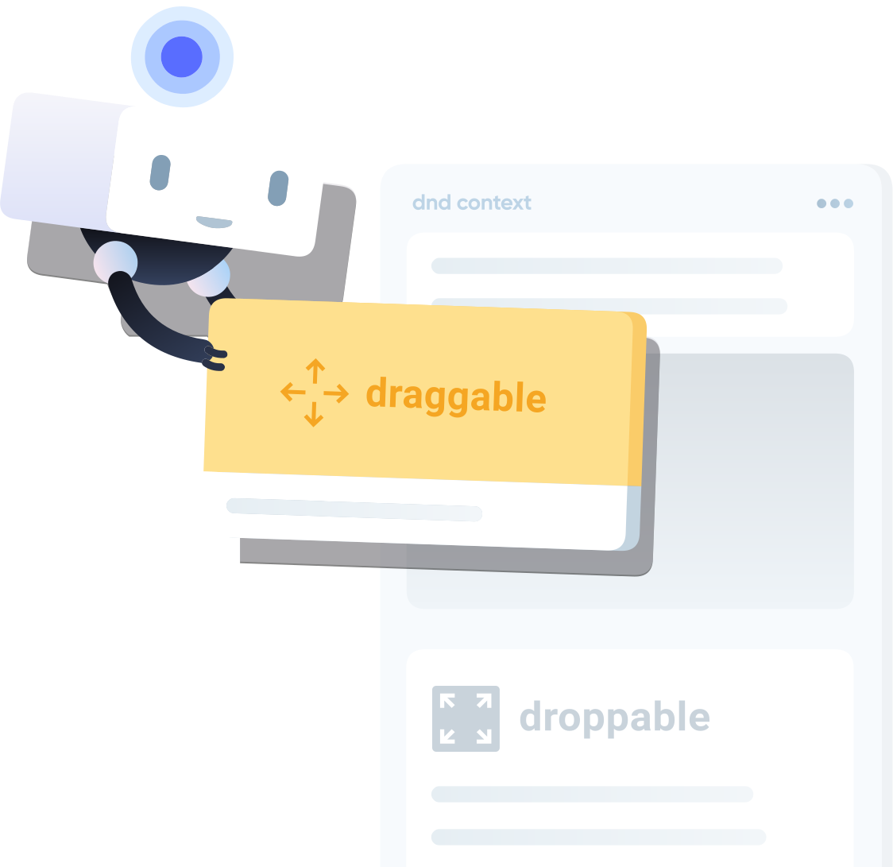

<p align="center"></p>

## Features

- **Built for React:** exposes hooks such as `useDraggable` and `useDroppable`, and won't require you to re-architect your app or create additional wrapper DOM nodes.
- **Feature packed:** customizable collision detection algorithms, multiple activators, draggable clone, drag handles, auto-scrolling, constraints, and so much more.
- **Supports a wide range of use cases:** vertical lists, horizontal lists, grids, multiple containers, nested contexts, variable sized list and grids, transformed items, virtualized lists.
- **Zero dependencies and modular:** the core of the library weighs only 10kb. It's built around built-in React state management and context, which keeps it lean.
- **Built-in support for multiple input methods:** Mouse, touch and keyboard sensors.
- **Fully customizable & extensible:** Customize every little detail, animations, transitions, behaviours, styles. Build your own sensors, collision detection algorithms, customize key bindings and so much more.
- **Accessibility:** keyboard support, sensible default aria attributes, customizable voiceover instructions and live regions built-in.
- **Performance:** It was built with performance and silky smooth animations in mind.
- **Presets:** Need to build a sortable interface? Check out `@dnd-kit/sortable`, which is a thin layer built on top of `@dnd-kit/core`. Preset for multiple container sortable lists \(Kanban\) coming soon.

### Powerfully simple

**dnd kit** is powerful and packed with features, and built with the hope of being the last drag and drop library you'll ever need, whether you're building a simple draggable interface element or a complex application built around drag and drop interactions .

At its core, **dnd kit** exposes two main concepts: [Draggable](api-documentation/draggable/) items and [Droppable](api-documentation/droppable.md) containers. Transform your existing components using the `useDraggable` and `useDroppable` hooks. Manage events and customize the behaviour of your application using the [`<DndContext>`](api-documentation/context-provider/) provider. Check out our [quick start guide](guides/getting-started.md) to learn how get started with **dnd kit**.



### Extensibility

Extensibility is at the core of **dnd kit**. It was built is built to be lean and extensible. It ships with the features we believe most people will want most of the time, and provides extension points to build the rest on top of `@dnd-kit/core`.

A prime example of the level of extensibility of **dnd kit** is the[ Sortable preset](presets/sortable.md), which is built using the extension points that are exposed by `@dnd-kit/core`.

The primary extension points of **dnd kit** are:

- [Sensors](api-documentation/sensors/)
- [Modifiers](api-documentation/modifiers.md)
- [Constraints](api-documentation/constraints.md)
- Custom collision detection algorithms

### Accessibility

Building accessible drag and drop interfaces is hard; **dnd kit** has a number of sensible defaults and starting points to help you make your drag and drop interface accessible:

- Customizable **screen reader instructions** for how to interact with draggable items
- Customizable **live region updates** to provide screen reader announcements in real-time of what is currently happening with draggable and droppable elements.
- Sensible defaults for **`aria` attributes** that should be passed to draggable items

Check out our [Accessibility guide](guides/accessibility.md) to learn more about how you can help provide a better experience for screen readers.

### Architecture

Unlike most drag and drop libraries, **dnd kit** intentionally is **not** built on top of the [HTML5 Drag and drop API](https://developer.mozilla.org/en-US/docs/Web/API/HTML_Drag_and_Drop_API). This was a deliberate architectural decision, that does come with tradeoffs that you should be aware of before deciding to use it, but for most applications, we believe the benefits outweigh the tradeoffs.

The HTML5 Drag and drop API has some severe **limitations**. It does not support touch devices, which means that the libraries that are built on top of it need to expose an entirely different implementation to support touch devices. This typically increases the complexity of the codebase and the overall bundle size of the library. Further, it requires workarounds to implement common use cases such as customizing the drag preview, locking dragging to a specific axis or to the bounds of a container, or animating the dragged item as it is picked up.

The main **tradeoff** with not using the HTML5 Drag and drop API is that you won't be able to drag from the desktop or between windows. If the drag and drop use-case you have in mind involves this kind of functionality, you'll definitely want to use a library that's built on top of the HTML 5 Drag and drop API. We highly recommend you check out [react-dnd](https://github.com/react-dnd/react-dnd/) for a React library that's has a native HTML 5 Drag and drop backend.

### Performance

#### **Minimizing DOM mutations**

**dnd kit** lets you build drag and drop interfaces without having to mutate the DOM every time an item needs to shift position.

This is possible because **dnd kit** lazily calculates and stores the initial positions and client rects of your droppable containers when a drag operation is initiated. These positions are passed down to your components that use `useDraggable` and `useDroppable` so that you can compute the new positions of your items while a drag operation is underway, and move them to their new positions using performant CSS properties that do not trigger a repaint such as `translate3d` and `scale`. For an example of how this can be achieved, check out the implementation of the sorting strategies that are exposed by the [`@dnd-kit/sortable`](presets/sortable.md) library.

This isn't to say that you can't shift the position of the items in the DOM while dragging, this is something that **is supported** and sometimes inevitable. In some cases, it won't be possible to know in advance what the new position and layout of the item until you move it in the DOM. Just know that these kind of mutations to the DOM while dragging are much more expensive and will cause a repaint, so if possible, prefer computing the new positions using `translate3d` and `scale`.

#### Synthetic events

**dnd kit** also uses [SyntheticEvent listeners](https://reactjs.org/docs/events.html) for the activator events of all sensors, which leads to improved performance over manually adding event listeners to each individual draggable node.

# Working in the `@dnd-kit` repository

## Packages contained in this repository

- `@dnd-kit/core`
- `@dnd-kit/sortable`
- `@dnd-kit/modifiers`
- `@dnd-kit/utilities`

## Running storybook

```sh
yarn start:storybook
```

Runs the storybook
Open [http://localhost:6006](http://localhost:6006) to view it in the browser.

<p align="center">

</p>

## Development workflow

You'll need to install all the dependencies in the root directory. Since the `@dnd-kit` is a monorepo that uses Lerna and Yarn Workspaces, npm CLI is not supported (only yarn).

```sh
yarn install
```

This will install all dependencies in each project, build them, and symlink them via Lerna

## Development workflow

In one terminal, run tsdx watch in parallel:

```sh
yarn start
```

This builds each package to `<packages>/<package>/dist` and runs the project in watch mode so any edits you save inside `<packages>/<package>/src` cause a rebuild to `<packages>/<package>/dist`. The results will stream to to the terminal.

### Working with the playground

You can play with local packages in the Parcel-powered playground.

```sh
yarn start:playground
```

This will start the playground on `localhost:1234`. If you have lerna running watch in parallel mode in one terminal, and then you run parcel, your playground will hot reload when you make changes to any imported module whose source is inside of `packages/*/src/*`. Note that to accomplish this, each package's `start` command passes TDSX the `--noClean` flag. This prevents Parcel from exploding between rebuilds because of File Not Found errors.

Important Safety Tip: When adding/altering packages in the playground, use `alias` object in package.json. This will tell Parcel to resolve them to the filesystem instead of trying to install the package from NPM. It also fixes duplicate React errors you may run into.

### Running Cypress

(In a third terminal) you can run Cypress and it will run the integration tests against storybook.
