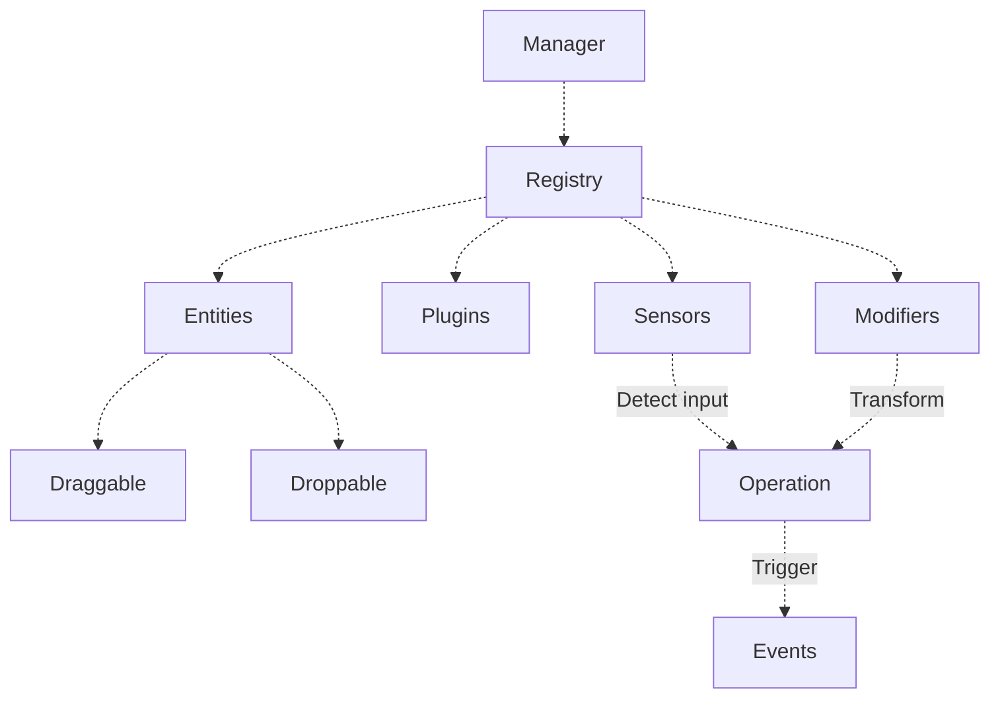

The `DragDropManager` is the central orchestrator of the drag and drop system. It coordinates all interactions between draggable and droppable elements.



## Usage

Create a manager instance to coordinate drag and drop interactions:

```js
import {DragDropManager} from '@dnd-kit/dom';

const manager = new DragDropManager();
```

<ParamField path="options" type="object">
  Optional configuration for the manager:
  - `sensors`: Array of [sensors](/extend/sensors) to detect drag interactions
  - `plugins`: Array of [plugins](/extend/plugins) to extend functionality
  - `modifiers`: Array of [modifiers](/extend/modifiers) to customize behavior
</ParamField>

## Configuration

The manager comes with sensible defaults, but you can customize its behavior:

```js
import {
  DragDropManager,
  KeyboardSensor,
  PointerSensor,
} from '@dnd-kit/dom';

const manager = new DragDropManager({
  // Sensors detect drag interactions
  sensors: [
    PointerSensor,  // Handles mouse and touch
    KeyboardSensor, // Enables keyboard navigation
  ],

  // Plugins extend functionality
  plugins: [
    AutoScroller,   // Automatic scrolling during drag
    Accessibility,  // ARIA attributes management
  ],

  // Modifiers customize drag behavior
  modifiers: [
    restrictToWindow, // Keeps dragged items within window bounds
  ],
});
```

<AccordionGroup>
  <Accordion title="Default configuration">
    The manager includes these defaults out of the box:

    **Sensors**
    - `PointerSensor`: Handles mouse and touch interactions
      - Mouse: Activates immediately on drag handle
      - Touch: 250ms delay with 5px movement tolerance
      - Other pointers: 200ms delay with 5px distance threshold
    - `KeyboardSensor`: Enables keyboard navigation with arrow keys

    **Plugins**
    - `Accessibility`: Manages ARIA attributes and announcements
    - `AutoScroller`: Scrolls containers when dragging near edges
    - `Cursor`: Updates cursor appearance during drag
    - `Feedback`: Controls visual feedback during drag
    - `PreventSelection`: Prevents text selection while dragging
    - `ScrollListener`: Monitors scroll events during drag
    - `Scroller`: Handles programmatic scrolling
  </Accordion>
</AccordionGroup>

## Events

The manager's `monitor` lets you observe drag and drop events:

```js
// Observe drag start
manager.monitor.addEventListener('beforedragstart', (event) => {
  // Optionally prevent dragging
  if (shouldPreventDrag(event.operation.source)) {
    event.preventDefault();
  }
});

// Track movement
manager.monitor.addEventListener('dragmove', (event) => {
  const {source, position} = event.operation;
  console.log(`Dragging ${source.id} to ${position.current}`);
});

// Detect collisions
manager.monitor.addEventListener('collision', (event) => {
  const [firstCollision] = event.collisions;
  if (firstCollision) {
    console.log(`Colliding with ${firstCollision.id}`);
  }
});

// Listen for when dragging ends
manager.monitor.addEventListener('dragend', (event) => {
  const {source, target, canceled} = event.operation;
  if (!canceled && target) {
    console.log(`Dropped ${source.id} onto ${target.id}`);
  }
});
```

### Available Events

<ResponseField name="beforedragstart" type="Event">
  Fires before drag begins. Can be prevented.
  <Expandable title="Properties">
    <ResponseField name="operation" type="object">
      The drag operation that is about to begin
    </ResponseField>
    <ResponseField name="preventDefault" type="function">
      Call to prevent the drag operation from starting
    </ResponseField>
  </Expandable>
</ResponseField>

<ResponseField name="dragstart" type="Event">
  Fires when drag starts.
  <Expandable title="Properties">
    <ResponseField name="operation" type="object">
      The current drag operation
    </ResponseField>
    <ResponseField name="nativeEvent" type="Event">
      The original browser event that triggered the drag
    </ResponseField>
  </Expandable>
</ResponseField>

<ResponseField name="dragmove" type="Event">
  Fires during movement. Can be prevented.
  <Expandable title="Properties">
    <ResponseField name="operation" type="object">
      The current drag operation
    </ResponseField>
    <ResponseField name="to" type="Point">
      The destination coordinates
    </ResponseField>
    <ResponseField name="by" type="Point">
      The movement delta
    </ResponseField>
    <ResponseField name="nativeEvent" type="Event">
      The original browser event
    </ResponseField>
  </Expandable>
</ResponseField>

<ResponseField name="dragover" type="Event">
  Fires when over a droppable. Can be prevented.
  <Expandable title="Properties">
    <ResponseField name="operation" type="object">
      The current drag operation
    </ResponseField>
  </Expandable>
</ResponseField>

<ResponseField name="collision" type="Event">
  Fires on droppable collision. Can be prevented.
  <Expandable title="Properties">
    <ResponseField name="collisions" type="Collision[]">
      Array of detected collisions with droppable targets
    </ResponseField>
  </Expandable>
</ResponseField>

<ResponseField name="dragend" type="Event">
  Fires when drag ends.
  <Expandable title="Properties">
    <ResponseField name="operation" type="object">
      The completed drag operation
    </ResponseField>
    <ResponseField name="canceled" type="boolean">
      Whether the operation was canceled
    </ResponseField>
    <ResponseField name="nativeEvent" type="Event">
      The original browser event
    </ResponseField>
  </Expandable>
</ResponseField>

## Registration

The manager's `registry` tracks draggable and droppable elements:

```js
// Manual registration
const cleanup = manager.registry.register(draggable);
cleanup(); // Or manager.registry.unregister(draggable);

// Auto-registration with manager reference
const draggable = new Draggable({
  id: 'draggable-1',
  element,
}, manager);

// Opt out of auto-registration
const draggable = new Draggable({
  id: 'draggable-1',
  element,
  register: false
}, manager);
```

<Tip>
  Elements automatically register when created with a manager reference. Only use manual registration for advanced use cases.
</Tip>

## API Reference

### Properties

- `registry`: Tracks active elements and extensions
  - `draggables`: Map of registered draggable elements
  - `droppables`: Map of registered droppable elements
  - `plugins`: Registry of active plugins
  - `sensors`: Registry of active sensors
  - `modifiers`: Registry of active modifiers

- `dragOperation`: Current drag operation state
  - `source`: Currently dragged element
  - `target`: Current drop target
  - `position`: Current drag coordinates
  - `status`: Current operation status
  - `canceled`: Whether operation was canceled

- `monitor`: Event system
  - `addEventListener`: Add event listener
  - `removeEventListener`: Remove listener

- `renderer`: Integration with asynchronous renderers such as React

### Methods

<ParamField path="destroy()" type="function">
  Clean up the manager and all registered elements:
  - Unregisters all draggables and droppables
  - Cleans up all plugins, sensors, and modifiers
  - Removes all event listeners
</ParamField>

## Lifecycle

1. **Initialization**
   - Manager created
   - Default plugins and sensors registered
   - Custom configuration applied

2. **Registration**
   - Draggable and droppable elements register
   - Plugins initialize
   - Event listeners bound

3. **Operation**
   - Drag operations tracked
   - Events dispatched
   - Collisions detected

4. **Cleanup**
   - Elements unregister
   - Event listeners removed
   - Resources released
